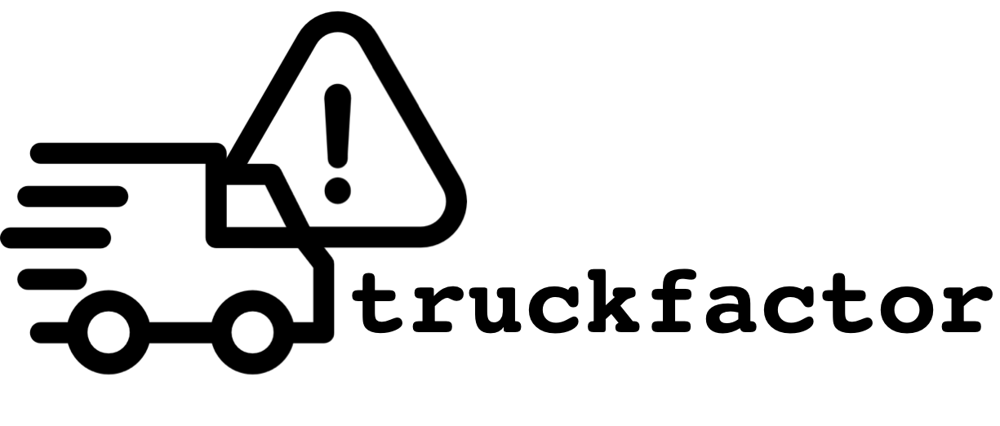

# What is this?

This tool, `truckfactor` computes the 
[truck (bus/lorry/lottery) factor](https://en.wikipedia.org/wiki/Bus_factor) for a 
given Git repository.

The truck factor is

  > the number of people on your team that have to be hit by a truck (or quit) 
  > before the project is in serious trouble
  >
  > L. Williams and R. Kessler, Pair Programming Illuminated. Addison Wesley, 2003.

<!-- One of the earliest occurrences of the term in a real project was in the Python
mailing list: 
["If Guido was hit by a bus?"](https://legacy.python.org/search/hypermail/python-1994q2/1040.html) -->


## Installation

```
pip install truckfactor
```

### Requirements

The tool requires that `git` is installed and accessible on `PATH`.


## How to use it?

You have to either point the tool to a directory containing a Git repository or
to a URL with a remote repository. In case a URL is given, the tool will clone
the repository into a temporary directory.

From the terminal, the tool can be run as in the following:

```
Usage:
  truckfactor <repository> [<commit_sha>] [--output=<kind>]
  truckfactor -h | --help
  truckfactor --version

Options:
  -h --help     Show this screen.
  --version     Show version.
  --output=<kind>  Kind of output, either csv or verbose.
```

For example, in its most basic form it can be called like this:

```bash
$ truckfactor <path_or_url_to_repository>
The truck factor of <path_to_repository> (<commit_sha>) is: <number>
```

If no `output` switch is given, the tool produces a single line output above. Otherwise, it will output a line in CSV format or in key: value form.


Calling it from code:

```python
from truckfactor.compute import main


truckfactor, commit_sha = main("<path_to_repo>")
```


# How does the tool compute the truck factor?

In essence the tool does the following:

  * Reads a git log from the repository
  * Computes for each file who has the _knowledge ownership_ of it.
    - A contributor has knowledge ownership of a file when she edited the most 
    lines in it.
    - That computation is inspired by 
    [A. Thornhill _Your Code as a Crime Scene_](https://pragprog.com/titles/atcrime/your-code-as-a-crime-scene/).
    - Note, only for text files knowledge ownership is computed. The tool may 
    not return a good answer for repositories containing only binary files.
  * Then similar to [G. Avelino et al. *A novel approach for estimating Truck Factors*](https://peerj.com/preprints/1233.pdf) 
  low-contributing authors are removed from the analysis as long as still more 
  than half of all files have a knowledge owner. The amount of remaining 
  knowledge owners is the truck factor of the given repository.


# Why does it exist?

This tool was developed since in Dec. 2020, we could not find an open-source and readily installable tool to compute truck factors of projects on PyPI or Rubygems.

<!-- 
## References

https://link.springer.com/article/10.1007/s11219-019-09457-2

A novel approach for estimating truck factors.
https://github.com/aserg-ufmg/Truck-Factor

Assessing the Bus Factor of Git Repositories (https://ieeexplore.ieee.org/stamp/stamp.jsp?arnumber=7081864&casa_token=fJYjmp-T3RUAAAAA:o_c0hD_yzQHTQJF0rGtEldCmxWlj_E0qn-NN67dxk4rps-p3fcBKpzzonY5SuFez8NEJ5sEx&tag=1)
https://github.com/atlanmod/busfactor
https://github.com/SOM-Research/busfactor
   > the minimum number of people on your team who must be hit by a truck so that your project gets into serious trouble (Bowler, M. (2005). Truck factor. Online. http://www.agileadvice.com/2005/05/15/agilemanagement/truck-factor/, )

Quantifying and mitigating turnover-induced knowledge loss: case studies of Chrome and a project at Avaya
-> no tool available

Are Heroes common in FLOSS projects?
https://dl.acm.org/doi/pdf/10.1145/1852786.1852856?casa_token=zZmr-B41OKYAAAAA:z1z_-tQivlm19DqvLysjT2ZNOwvmCmeU_KqtNBM9I3R2ol7EFbQtxx8nFKe921jQgupkAwPRVtct
on SVN no tool linked


On the difficulty of computing the Truck Factor
https://www.researchgate.net/profile/Filippo_Ricca/publication/221219219_On_the_Difficulty_of_Computing_the_Truck_Factor/links/5746d7db08ae9ace8425ec3e/On-the-Difficulty-of-Computing-the-Truck-Factor.pdf
SVN no tools linked
 -->


-----

# Attributions

The logo is combined from two logos from flaticon:
  * Truck: <div>Icons made by <a href="https://www.flaticon.com/authors/kiranshastry" title="Kiranshastry">Kiranshastry</a> from <a href="https://www.flaticon.com/" title="Flaticon">www.flaticon.com</a></div>
  * Warning sign: <div>Icons made by <a href="https://www.flaticon.com/authors/gregor-cresnar" title="Gregor Cresnar">Gregor Cresnar</a> from <a href="https://www.flaticon.com/" title="Flaticon">www.flaticon.com</a></div>


